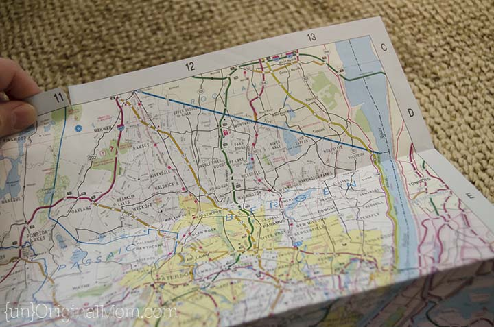

#### You have chosen to go explore inside the farmhouse!
You go inside of the farmhouse and you feel goosebumps starting to form on your skin. You see something
on the corner on the floor. There appears to be nobody inside, so you walk over to the corner. You see a
piece of paper on the the floor and pick it up. It's a map of the cornfield maze!

You follow the [map](ending.md) to get to the end of the maze.

###### image credit: unoriginalmom.com